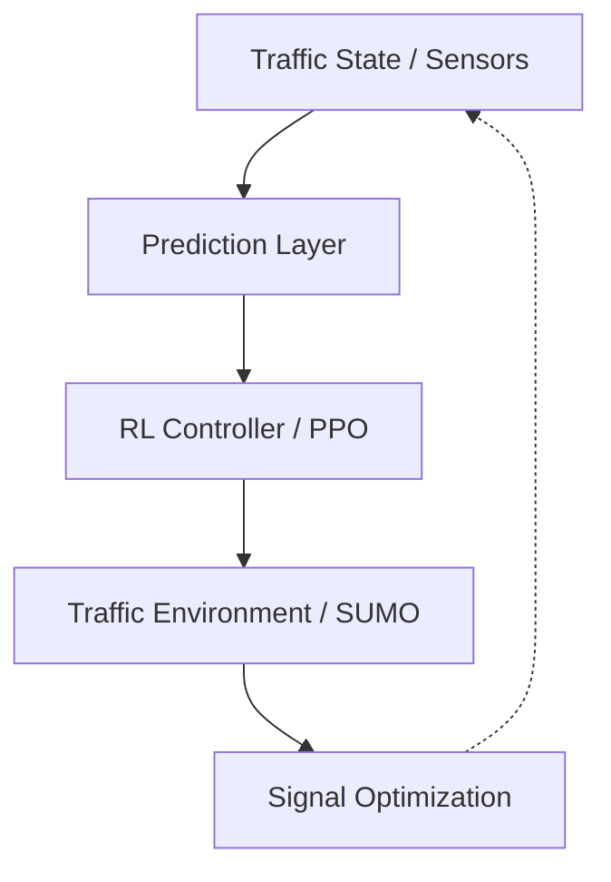

# NEXUS-ATMS
### Traffic Optimization Operating System

NEXUS-ATMS is a foundational Smart City Traffic Operating System. It replaces traditional heuristic traffic lights with an adaptive, Reinforcement Learning (RL) driven controller that dynamically optimizes signal phases across an entire urban grid in real-time.

## Core Identity & Features

NEXUS-ATMS is designed as a modular, extensible city-scale platform:
- **Intelligent Routing Brain**: Utilizes state-of-the-art RL agents (`PPO`, `D3QN`) to optimize traffic flow, minimize queue lengths, and drastically reduce idle times.
- **Micro-Simulation Environment**: Built atop Eclipse SUMO, providing a highly realistic multi-agent traffic environment for training and evaluation.
- **Emergency Corridors (Green Wave)**: A dedicated sub-system that preempts standard logic to instantly carve unimpeded pathways for emergency vehicles.
- **Carbon Tracking Engine**: Real-time telemetry translation that calculates vehicle emission reductions based on idle-time minimization.
- **Pedestrian Safety & Cybersecurity**: Extensible modules to ensure physical and digital infrastructure safety.

## Architecture Pipeline



## Running the Platform

NEXUS-ATMS is fully independent and runnable out-of-the-box.

### 1. Training the RL Agents
```bash
python train.py --agent ppo --scenario normal
```

### 2. Evaluating Performance
```bash
python evaluate.py --agent ppo --scenario rush_hour --gui
```
